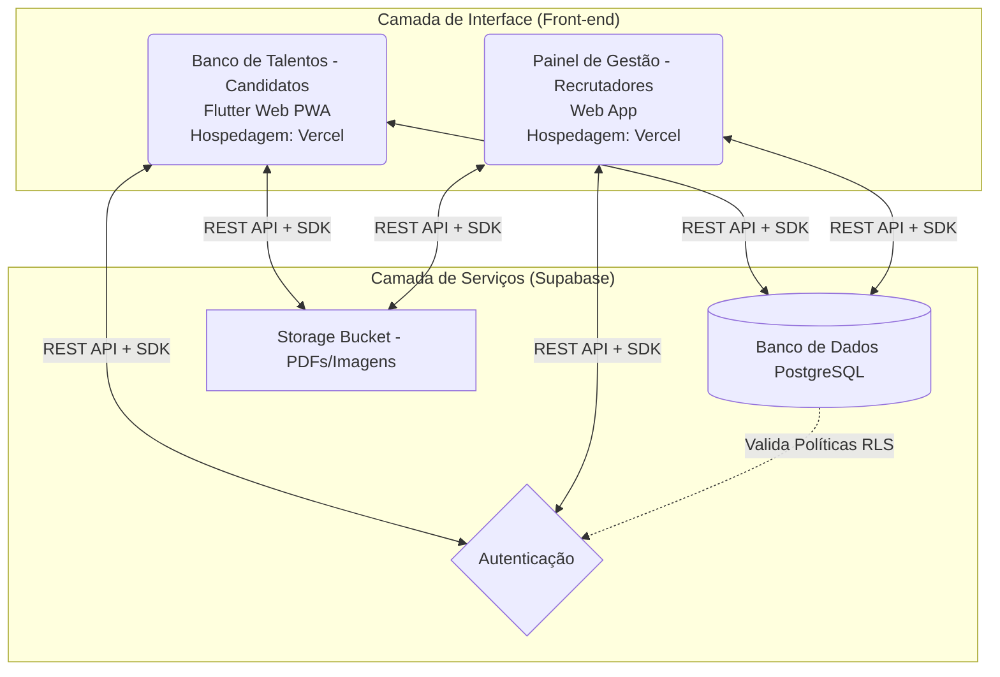
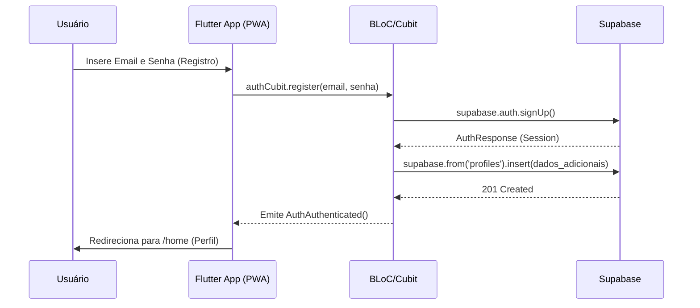

# Banco de Talentos 🚀

Documentação oficial do projeto **Banco de Talentos**, uma plataforma desenvolvida para modernizar e centralizar o cadastro de currículos e perfis profissionais de candidatos. O sistema é concebido na arquitetura Serverless, priorizando a performance, segurança e a experiência do usuário através da abordagem Progressive Web App (PWA).

---

## 1. Engenharia de Requisitos

A plataforma visa otimizar o processo de captação de talentos através de duas interfaces segregadas: uma voltada para a inserção de dados pelo candidato (PWA) e outra para o recrutador (Painel Administrativo).

### Requisitos Funcionais (RF)
- **RF01 - Autenticação e Autorização:** O candidato deve poder criar uma conta, realizar login e redefinir senha.
- **RF02 - Gestão de Perfil:** O candidato deve poder preencher e atualizar seus dados pessoais, definir sua disponibilidade ("Status Atual") e atualizar foto.
- **RF03 - Gestão de Currículo:** O candidato deve ser capaz de realizar upload de um arquivo PDF contendo seu currículo completo.
- **RF04 - Experiências e Cursos:** O candidato deve poder realizar um CRUD (Criar, Ler, Atualizar, Deletar) de suas experiências profissionais e cursos extracurriculares.
- **RF05 - Setores de Interesse:** O candidato deve poder selecionar e atualizar múltiplas tags/setores nos quais tem interesse em atuar (ex: Tecnologia, Administrativo, Vendas).
- **RF06 - Exclusão de Conta:** O candidato deve ter a possibilidade de revogar seu consentimento de dados, excluindo sua conta.

### Requisitos Não Funcionais (RNF)
- **RNF01 - Padrão PWA:** O sistema do candidato deve rodar primariamente em ambiente Web Mobile, suportando a instalação nativa ("Adicionar à Tela Inicial").
- **RNF02 - Segurança de Dados (RLS):** O banco de dados deve utilizar Row-Level Security para garantir que um candidato só leia e modifique os próprios dados.
- **RNF03 - Desempenho SPA:** A aplicação deve utilizar navegação Single Page Application, garantindo transições fluidas e estado de rotas contínuo.
- **RNF04 - Clean Architecture:** O sistema deve ter fronteiras bem definidas entre as regras de negócio, chamadas de API, gerência de estado e interface (UI).

---

## 2. Arquitetura e Fluxo do Sistema

O Banco de Talentos é suportado por uma arquitetura em duas vias front-end conectadas a um Backend-as-a-Service (BaaS) centralizado.

### Diagrama de Arquitetura



### Fluxo de Registro e Cadastro (Candidato)



---

## 3. Estrutura do Projeto (Clean Architecture)

A organização das pastas e do código no Flutter seguiu o conceito de camadas de domínio, para facilitar a injeção de dependências e a criação de testes.

```text
lib/
├── core/         # Componentes transversais
│   ├── config/   # Envied, Variaveis de ambiente (.env)
│   ├── di/       # Configuração de injeção de dependência (GetIt/Injectable)
│   ├── errors/   # Parsers e Tratamento de Falhas
│   └── utils/    # Validadores e Formatadores (Regex, CPF)
├── data/         # Camada de Dados
│   ├── datasources/ # Implementação das chamadas SDK ao Supabase
│   └── repositories/ # Implementação abstrata (AuthRepositoryImpl)
├── domain/       # Camadas de Regras de Negócio e Contratos
│   ├── entities/    # Modelos (Profile, Course, Experience)
│   ├── repositories/# Contratos (Interfaces) dos repositórios
│   └── usecases/    # Ações puras da aplicação (LoginUseCase, GetProfileUseCase)
└── presentation/ # Camada Visual (Flutter)
    ├── components/  # Elementos genéricos da UI (Botões animados, Toasts, Inputs)
    ├── cubits/      # Gerência de Estado (AuthCubit, ProfileCubit) usando BLoC
    ├── screens/     # Páginas/Rotas orquestradoras
    └── widgets/     # Componentes fracionados de uma tela (ex: login_form, login_header)
```

---

## 4. Stack de Tecnologias & Bibliotecas Utilizadas

A base do desenvolvimento foi o **Flutter 3.x**. As principais bibliotecas incorporadas (visíveis no `pubspec.yaml`) e suas responsabilidades arquiteturais são:

### Core e Integrações
- **`supabase_flutter`**: SDK oficial para integração com Autenticação, Banco de Dados (Postgres via PostgREST) e Armazenamento (Buckets).
- **`envied`** & **`envied_generator`**: Gerenciamento seguro de variáveis de ambiente, ofuscando e impedindo chaves hardcoded no código fonte (`.env`).

### Gerenciamento de Estado e Rotas
- **`flutter_bloc`**: Gerenciamento de estado reativo das telas através de fluxos unidirecionais (State Management Pattern).
- **`go_router`**: Navegação declarativa robusta baseada na URL. Crucial para aplicações Web, resolvendo quebras no botão "Voltar" do navegador e roteamento SPA via Vercel.

### Injeção de Dependência
- **`get_it`**: Localizador de serviços (Service Locator) para desacoplar a criação dos UseCases e Repositories do ciclo de vida dos Widgets.
- **`injectable`**: Geração de código automatizada (annotations) para povoar o `GetIt`, minimizando o código de boilerplate (arquivos `.config.dart`).

### Utilitários
- **`url_launcher`**: Para redirecionamento web externo (visualização do PDF do currículo).
- **`build_runner`**: Ferramenta de build subjacente utilizada pelos geradores de código (Injectable e Envied).

---

> **Desenvolvido por @Matheus Rogato.**
